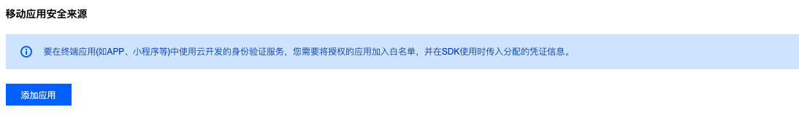
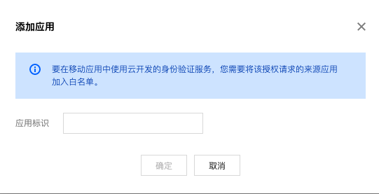
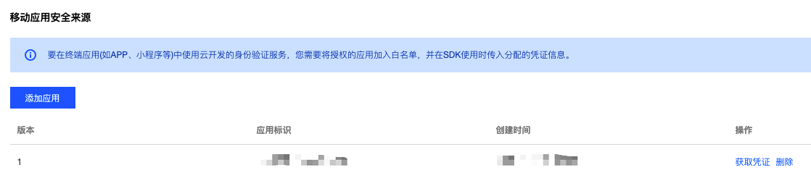
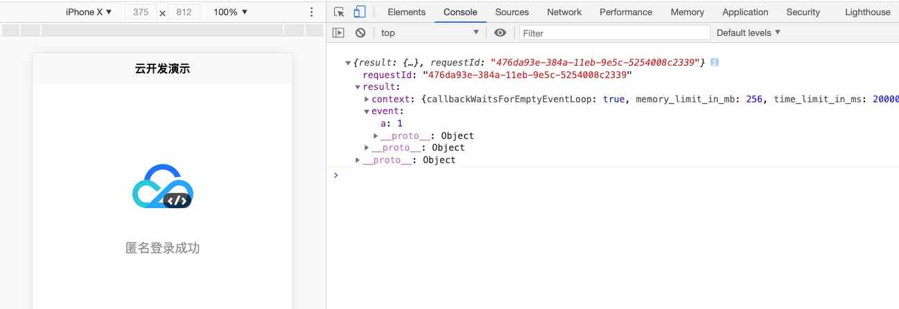

# UNI-APP使用云开发跨全端开发实战讲解

UNI-APP 是一个使用 Vue.js 开发所有前端应用的框架，开发者编写一套代码，可发布到iOS、Android、Web（响应式）、以及各种小程序（微信/支付宝/百度/头条/QQ/钉钉/淘宝）、快应用等多个平台。

本文为大家讲解如何采用云开发官方JS-SDK，接入云开发后端服务并支持UNI-APP全部端（不止于微信小程序）

## JS-SDK和UNI-APP适配器

#### 1.JS-SDK和适配器

云开发官方提供的@cloudbase/js-sdk，主要用来做常规WEB、H5等应用（浏览器运行）的云开发资源调用，也是目前最为完善的客户端SDK。

目前市面上大部分的轻应用、小程序包括移动应用APP都是采用JS来作为开发语言的，所以我们可以对TA进行轻微改造，就可以轻松使用在各种平台中。

但是单独改造SDK包会有些许风险，比如在原SDK包升级时需要重新构造，就造成了无穷无尽的麻烦，改造成本相当大。

官方的产品小哥哥深知这种不适和痛苦，所以在@cloudbase/js-sdk 中提供一套完整的适配扩展方案，遵循此方案规范可开发对应平台的适配器，然后搭配 @cloudbase/js-sdk 和适配器实现平台的兼容性。

不了解的小伙伴肯定会有些茫然，我来用浅显的语言解释一下，就是@cloudbase/js-sdk 将底层的网络请求以及相关基础需求以接口的形式暴露出来，我们按照平台的特殊API来补充这些接口，sdk就可以根据这些补充的接口，无障碍的运行在平台中了。

如果我们想在UNI-APP中使用@cloudbase/js-sdk ，底层网络请求你需要来补充，因为sdk原本是适应浏览器的，TA不知道UNI-APP怎么对外发请求，所以你需要将uni.request 方法补充到TA暴露的接口中。补充完毕后，@cloudbase/js-sdk 就可以在UNI-APP中活泼的运行了。

我们将所有的uni方法全部补充到JS-SDK暴漏的接口中去，就形成了一个完整的适配器，我们将其成为uni-app适配器。

#### 2.UNI-APP适配器

UNI-APP的整体接口都是公开透明的，我们在开发UNI-APP时也都遵照同一套接口标准。所以小编已经将uni-app适配器制作完毕，大家只需要在使用时接入适配器就可以了。

我们在项目目录main.js中引入云开发JS-SDK，然后接入我们的UNI-APP适配器即可。

``` js
import cloudbase from '@cloudbase/js-sdk'
import adapter from 'uni-app/adapter.js'

cloudbase.useAdapters(adapter);

cloudbase.init({
	env: '',//云开发环境ID
	appSign: '',//凭证描述
	appSecret: {
		appAccessKeyId: 1,//凭证版本
		appAccessKey: ''//凭证
	}
})

```

## 移动应用登录凭证

云开发SDK在使用过程中，向云开发服务系统发送的请求都会需要验证请求来源的合法性。

我们常规 Web 通过验证安全域名，而由于 UNI-APP 并没有域名的概念，所以需要借助安全应用凭证区分请求来源是否合法。

登录[云开发 CloudBase 控制台](https://console.cloud.tencent.com/tcb/env/safety)，在安全配置页面中的移动应用安全来源一栏：


点击“添加应用”按钮，输入应用标识： uni-app（也可以输入其他有标志性的名称），需要注意应用标识必须是能够标记应用唯一性的信息，比如微信小程序的 appId 、移动应用的包名等。


添加成功后会创建一个安全应用的信息，如下图所示：


我们需要保存一下上图中的版本（示例为1）、应用标识（示例为uni-app）、以及点击获取到的凭证（示例为demosecret）

在项目目录中，我们将main.js中的init部分补全
``` js
import cloudbase from '@cloudbase/js-sdk'
import adapter from 'uni-app/adapter.js'

cloudbase.useAdapters(adapter);

cloudbase.init({
	env: 'envid',//云开发环境ID，保证与你操作登录凭证一致
	appSign: 'uni-app',//凭证描述
	appSecret: {
		appAccessKeyId: 1,//凭证版本
		appAccessKey: 'demosecret'//凭证
	}
})

```

如此，你就可以正常的进行云开发的登录使用了。

需要注意以下4点：
1. 你需要设置uni-app的各端安全域名为：request：tcb-api.tencentcloudapi.com、uploadFile：cos.ap-shanghai.myqcloud.com、download：按不同地域配置
2. 使用此种方法接入云开发是全端支持，并不会享有微信小程序生态的一些便利，微信小程序开发还是需要依赖正常请求调用过程（将云开发作为服务器来对待），但你可以判断wx来使用wx.cloud来兼容。
3. 使用云开发的匿名登录时，受各端实际情况影响，可能不能作为常久唯一登录id，需要根据自身业务建立统一账户体系，具体可使用自定义登录来进行。
4. UNI-APP支持WEB网页端上线时，需要将网页域名配置到云开发安全域名中（防止WEB下载文件导致跨域）

## 示例代码详解

示例项目中已经基本构建了uni-app使用云开发的各种流程代码。

在页面中进行匿名登录：
``` js
// index.vue
import cloudbase from '@cloudbase/js-sdk'
	export default {
		data() {
			return {
				title: '登录中'
			}
		},
		onLoad() {
			cloudbase.auth().anonymousAuthProvider().signIn().then(res => {
				this.title = '匿名登录成功'
			}).catch(err => {
				console.error(err)
			})
		}
	}
```

调用云函数并收到返回结果：
``` js
import cloudbase from '@cloudbase/js-sdk'
export default {
	methods: {
		call: function() {
			cloudbase.callFunction({
				name: "test",
				data: {
					a: 1
				}
			}).then((res) => {
				console.log(res)
			});
		}
	}
}
```

操作数据库：
``` js
import cloudbase from '@cloudbase/js-sdk'
export default {
	methods: {
		database: function() {
			cloudbase.database().collection('test').get().then(res => {
				console.log(res)
			})
		}
	}
}
```

实时数据库监听：
``` js
import cloudbase from '@cloudbase/js-sdk'
export default {
	methods: {
		socket: function() {
			let ref = cloudbase.database().collection('test').where({}).watch({
				onChange: (snapshot) => {
					console.log("收到snapshot", snapshot);
				},
				onError: (error) => {
					console.log("收到error", error);
				}
			});
		}
	}
}
```

上传文件（框架限制，WEB端无法操作）：
``` js
import cloudbase from '@cloudbase/js-sdk'
export default {
	methods: {
		upload: function() {
			uni.chooseImage({
				count: 1,
				sizeType: ['original', 'compressed'],
				sourceType: ['album'],
				success: function(res) {
					console.log(res.tempFilePaths[0])
					cloudbase.uploadFile({
						cloudPath: "test-admin.png",
						filePath: res.tempFilePaths[0],
						onUploadProgress: function(progressEvent) {
							console.log(progressEvent);
							var percentCompleted = Math.round((progressEvent.loaded * 100) / progressEvent.total);
						}
					}).then((result) => {
						console.log(result)
					});
				}
			});
		}
	}
}
```

下载文件（需要注意地域域名，配置安全域名）：
``` js
import cloudbase from '@cloudbase/js-sdk'
export default {
	methods: {
		download: function() {
			cloudbase.downloadFile({
				fileID: "cloud://demo-env-1293829/test-admin.png"
			}).then((res) => {
				console.log(res)
			});
		}
	}
}
```

## 部署步骤

1. 将项目下载后使用HBuilderX打开。

2. 按照获取移动安全凭证的指引，填写至mian.js相应处。

3. 打开目录命令行，npm i执行安装依赖。

3. 打开云开发控制台，开启匿名登录。

4. 新建一个默认的云函数，名称为test（逻辑内容直接返回event即可）

5. 新建一个数据库，名称为test（随便添加几个记录，设置权限为所有人可读）

6. 调整项目pages/index/index.vue中，21行代码，在登录成功后调用相应函数。

以下是WEB端运行时展示：


## 关于

1. uni-app适配器在util/adapter中，只进行了简单的测试，保证可用性，后续请关注[官网](https://www.cloudbase.net/sdk.html)获取最新适配器依赖

2. 此方法有别与uniCloud，是直接使用uni请求底层，依赖官方JS-SDK进行云开发服务的交互处理，在使用时注意区别。